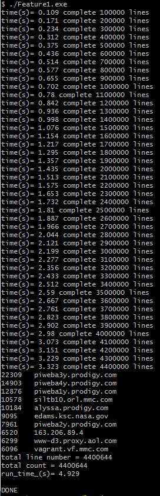
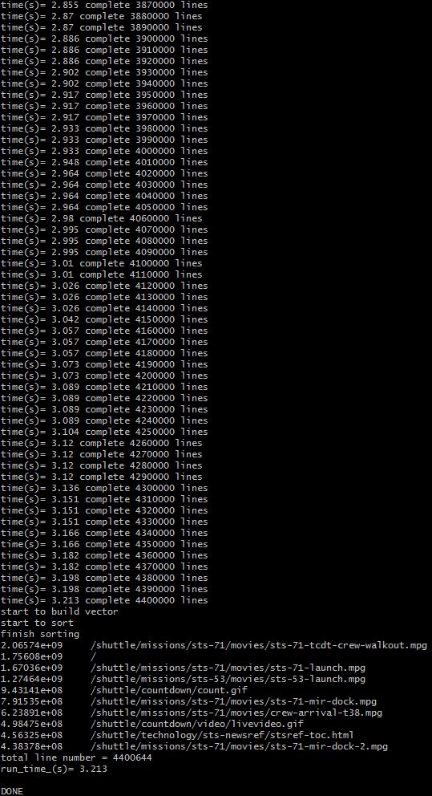
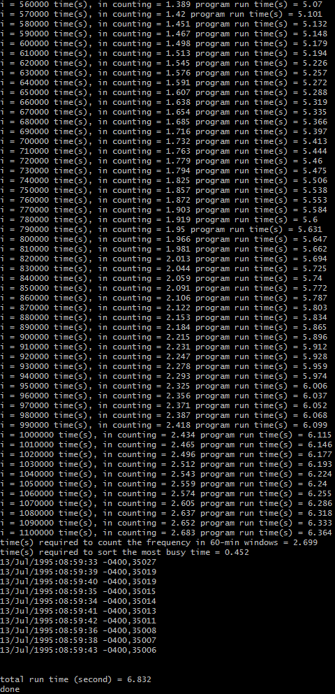
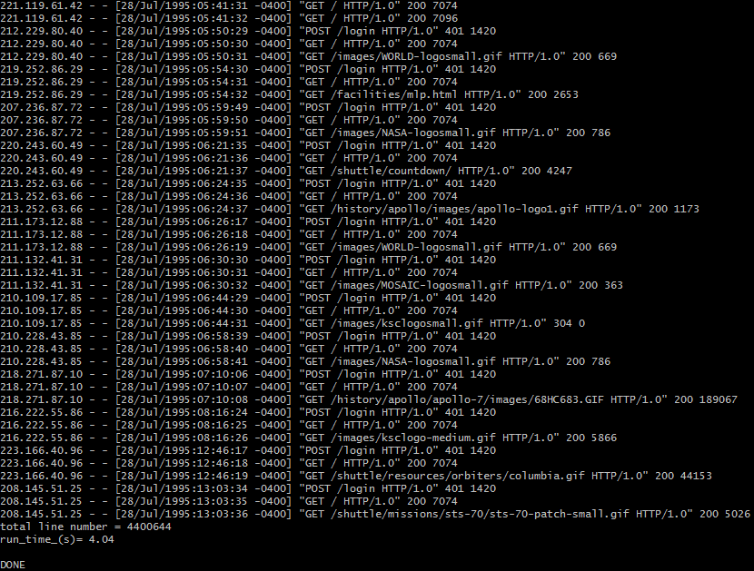

# Table of Contents
1. [Requrement / Caution](README.md#Requirement-/-Caution)
2. [Overview](README.md#Overview)
3. [Feature1 code Explanation](README.md#Feature1-code-Explanation)
4. [Feature2 code Explanation](README.md#Feature2-code-Explanation)
5. [Feature3 code Explanation](README.md#Feature3-code-Explanation)
6. [Feature4 code Explanation](README.md#Feature4-code-Explanation)
7. [Problem statement](README.md#Given-Challenge-Summary)

## Requirement / Caution
1) Manually delete the line with no charactor at the end of log file
The line with nothing at the end of log.txt was deleted manually.
If the '\n' at the end (line without anything at the end of file) was not delete, some run-time error will occur.

2) use C++11 standard to compile
Otherwise, syntax error will occur when compile.

3) when output text file was created in Unix environment, open it with notepad in Windows environment will cause error (new line character was not shown correctly), use TextPad to open it instead.

4) the provided exe files are compiled in Unix environment (Cygwin). They won't run on windows environment. To directly use these exe file (get the same thing if g++ is used to compile the .cpp file) type "./Feature1.exe", (without "") for example.

## Overview
Source codes need to be compiled with c++11 standard.
To compile with gcc
1)	Go to the directory that source file is located by
cd src
2)	Compile each file by

g++ -std=c++11 Feature1.cpp Feature1.exe

g++ -std=c++11 Feature2.cpp Feature2.exe

g++ -std=c++11 Feature3.cpp Feature3.exe

g++ -std=c++11 Feature4.cpp Feature4.exe

move the .exe file to the same location as the log.txt (otherwise won't work)
then run .exe file, file by file, by typing

./Feature1.exe

The output file will be produced in the same directory with the .exe file folder
In my computer, i7-4770 CPU @ 3.40 GHz, RAM 16 GB, 64-bit operating system,
I run call exe file in cygwin (unix environment for windows).

Feature 1 took roughly 5 seconds.

Feature 2 took roughly 3 seconds.

Feature 3 took roughly 7 seconds.

Feature 4 took roughly 4 seconds.

If use Visual studio, it need to be in release mode (not debug mode) to allow the resulting exe to run fastest. Roughly the same speed was achieved.

## Feature1 code Explanation
Unordered map was used to map the IP/requested host name with the number of count (number of request from the same IP)
This process allows the frequency (number of times) that each IP make the request to be counted.
Then, the map was transformed into a vector to sort and report the result via screen and output text file.

## Feature2 code Explanation
The same techniques (as in Feature 1) was used to count "the number of times" that each address was accessed.
The difference is that the "number of times" here is the file size that is transferred to the requesting IP. I note here that in the log.txt, some address entry was just "/ ". Thus, my result can have that entry too.

## Feature3 code Explanation
In this feature, the user define class was created to do the conversion from string timestamp to the total number of second, and other calculation. First, unordered_map was used to combine the different entry from the input file that has the same timestamp together. Then, the unordered_map was transformed into a vector for sorting. Using Vector instead of unordered_map right at the beginning is not recommend, because it will be a lot slower than the unordered map when a new item is insered into a vector (need to deallocate and allocate members, to add just one member into vector).

After the requency is sorted, then the summation over 20 second was calculated by using just one scan through the data. As the summation calculation was moved to the next adjacent timestamp, the old non-overlap part that is left behind was excluded, and the new part (that was not the part in the previous summation calculation) was added. This way, the summation calculation starting at each unique timestamp can be done fast.

## Feature4 code Explanation
First, the irrelevant entries from the log.txt were removed. The irrelevant entries were those request that has the total of fail login of 2 times or less. This is because the IP with 2 or less fail login should not be blocked. Then, 1) to be blocked list and 2) tracking list were created. Those who did 3 fails login within 20 second will be added into the blocked list. Tracking list is just for track the number of fail and success login. If success login occur, the fail login history of that IP will be deleted from the tracking list.

The data was processing line-by-line after majority of the irrelevant entries were excluded (as explained earlier). No "physical" exclusion from the data structure (unordered_map) was done to reduce run-time. "if" statement was used instead to neglect those who are not in the list (3+ fail login). The request that is "GET from the IP that has the total violation of 3 or more was evaluated too. First, the "to be blocked list" was checked to see if the IP in consideration should be blocked or not. If it is blocked, then the next entry will be evaluated. If it is not in the list, then the program determine if the the login attempt is fail (401) or success (200). Then, the tracking list was updated accordingly. The data processing stop at the end of the line.

## Given Challenge Summary

Picture yourself as a backend engineer for a NASA fan website that generates a large amount of Internet traffic data. Your challenge is to perform basic analytics on the server log file, provide useful metrics, and implement basic security measures. 

The desired features are described below: 

### Feature 1: 
List the top 10 most active host/IP addresses that have accessed the site.

### Feature 2: 
Identify the 10 resources that consume the most bandwidth on the site

### Feature 3:
List the top 10 busiest (or most frequently visited) 60-minute periods 

### Feature 4: 
Detect patterns of three failed login attempts from the same IP address over 20 seconds so that all further attempts to the site can be blocked for 5 minutes. Log those possible security breaches.

